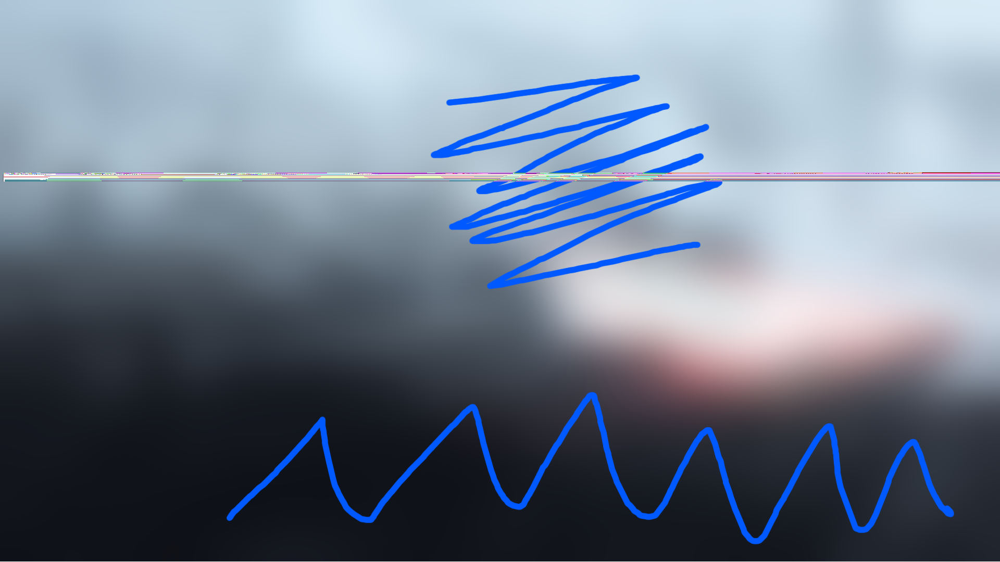

# SkiaSharp Image Loading Bug

This is a program to demonstrate an issue in `SkiaSharp 2.88.0-preview.224` (and later).

The sample program simply loads a test .png image and re-saves it, resulting in a corrupted image.

Rolling back the SkiaSharp dependency from `preview.224` to `preview 223` the issue doesn't happen.

We believe the issue is in loading the image (not saving) since when used
with rendering code, the image appears corrupted there too.

## Original Image

## Corrupted Image

